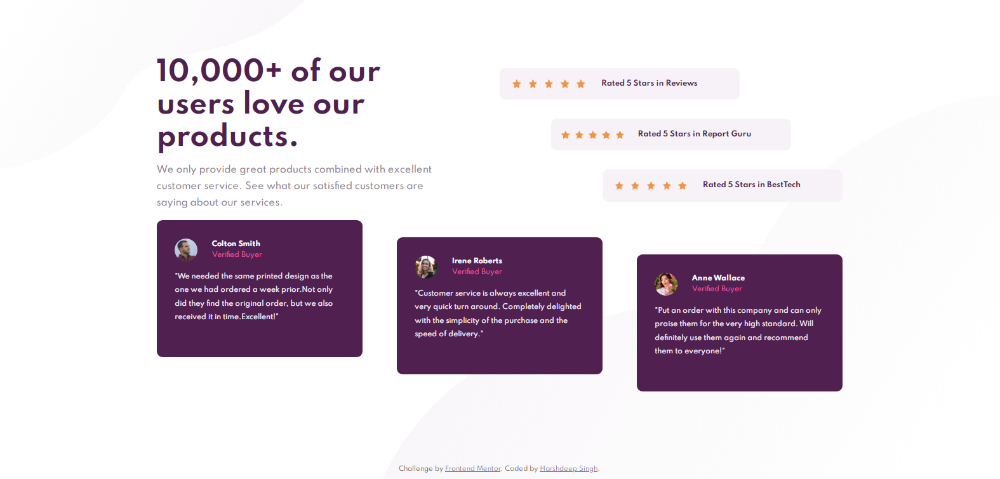

# Frontend Mentor - Social proof section solution

This is a solution to the [Social proof section challenge on Frontend Mentor](https://www.frontendmentor.io/challenges/social-proof-section-6e0qTv_bA). Frontend Mentor challenges help you improve your coding skills by building realistic projects. 

## Table of contents

- [Overview](#overview)
  - [The challenge](#the-challenge)
  - [Screenshot](#screenshot)
  - [Links](#links)
- [My process](#my-process)
  - [Built with](#built-with)
- [Author](#author)

**Note: Delete this note and update the table of contents based on what sections you keep.**

## Overview

### The challenge

Users should be able to:

- The challenge of the given solution is here [Click Here](https://www.frontendmentor.io/challenges/social-proof-section-6e0qTv_bA)

### Screenshot

### Links

- Solution URL: [Check it](https://github.com/JunDevHarsh/social-profile.git)
- Live Site URL: [Check it](https://social-proof-section-01.netlify.app/)

## My process

- Simple approach using basic css with flexbox and finally make it responsive.

### Built with

- Semantic HTML5 markup
- CSS custom properties
- Flexbox
- Mobile-first workflow

## Author

- Frontend Mentor - [@JunDevHarsh](https://www.frontendmentor.io/profile/JunDevHarsh)